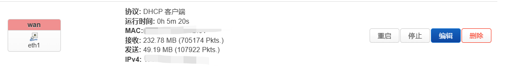
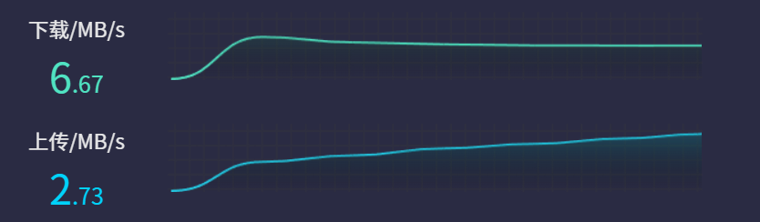
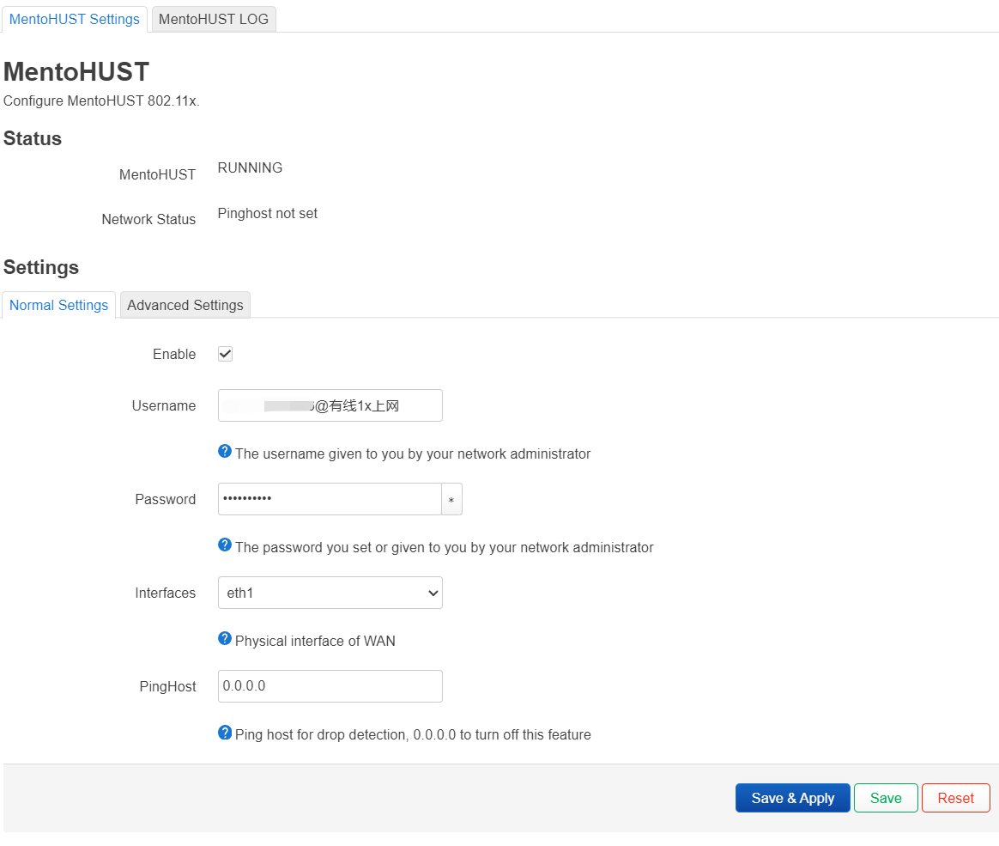
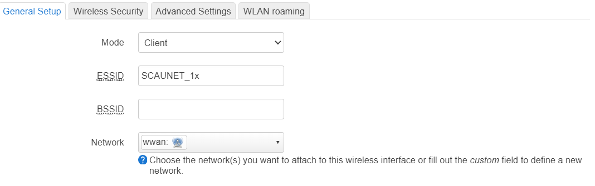
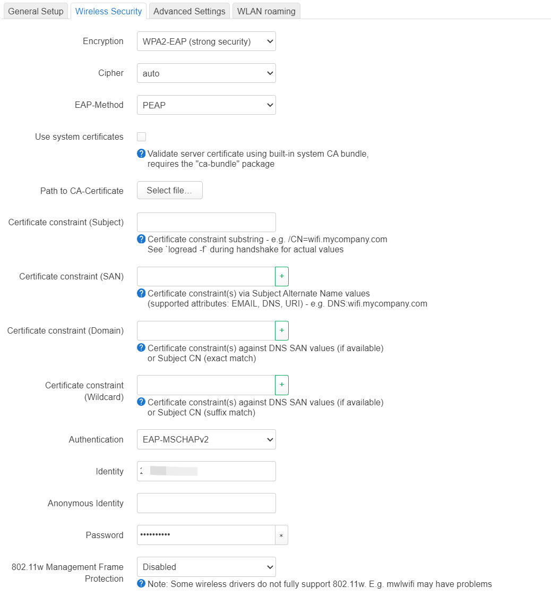
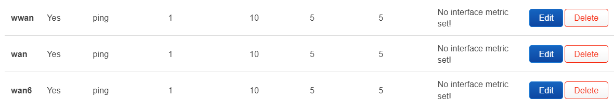
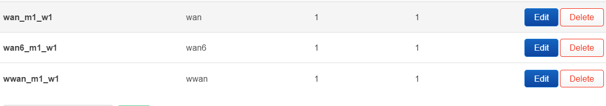

# -
# 折腾了几天研究了一下校园网 觉得有用的老铁点点赞助！

# 华农校园网折腾指南（叠网速&多设备）

## 先上单网口网速图

## 



为什么没有叠加网速图呢？因为楼主路由器太垃圾无线桥接时无论如何wan口会掉线但是理论上是可以叠加的！希望有人成功可以返图。

**首先准备可以刷openwrt的路由器并在编译固件时加入**

```
mentohust luci ua2f luci-app-ua2f iptables-mod-filter iptables-mod-ipopt iptables-mod-u32 iptables-mod-conntrack-extra kmod-ipt-u32 kmod-ipt-ipopt luci-app-mwan3
```

## 先说叠网速

### 网口设置

先网线接上路由器wan口

进入openwrt后进入mentohust



Username（账号）处填写学号@有线1x上网

Password填校园网密码（默认是学号）

注意Interfaces（接口）填wan口的物理接口

高级设置默认就好，然后开始认证

### WiFi设置

注意大部分openwrt默认的软件包中使用的都是wpad的精简版没有wpa2-eap协议所以在编译时需要更改为（wpad）


你🐉的wifi有两种认证方式，没有1x后缀的为网页认证，有1x后缀的是可以预先认证的（wpa2-eap）

点击radio1(5g)的scan(扫描)连接SCAUNET_1x



分配network为wwan

更改Encryption为wpa2-eap



连接后放一边备用

### 负载均衡







看图

双线叠加


## 再说破解连接设备限制

先人的智慧[EOYOHOO/Campus-network: 使用openwrt路由过校园网多设备检测（非破解） （宿舍共网） (github.com)](https://github.com/EOYOHOO/Campus-network?tab=readme-ov-file)

已知❀🐉使用的不是基于 IPv4 数据包包头内的 Identification 字段的检测 所以不用装kmod-rkp-ipid，这段规则

```
iptables -t nat -A PREROUTING -p udp --dport 53 -j REDIRECT --to-ports 53

iptables -t nat -A PREROUTING -p tcp --dport 53 -j REDIRECT --to-ports 53

# 通过 rkp-ipid 设置 IPID

# 若没有加入rkp-ipid模块，此部分不需要加入

iptables -t mangle -N IPID_MOD

iptables -t mangle -A FORWARD -j IPID_MOD

iptables -t mangle -A OUTPUT -j IPID_MOD

iptables -t mangle -A IPID_MOD -d 0.0.0.0/8 -j RETURN

iptables -t mangle -A IPID_MOD -d 127.0.0.0/8 -j RETURN

#由于本校局域网是A类网，所以我将这一条注释掉了，具体要不要注释结合你所在的校园网

# iptables -t mangle -A IPID_MOD -d 10.0.0.0/8 -j RETURN

iptables -t mangle -A IPID_MOD -d 172.16.0.0/12 -j RETURN

iptables -t mangle -A IPID_MOD -d 192.168.0.0/16 -j RETURN

iptables -t mangle -A IPID_MOD -d 255.0.0.0/8 -j RETURN

iptables -t mangle -A IPID_MOD -j MARK --set-xmark 0x10/0x10

# 防时钟偏移检测

iptables -t nat -N ntp_force_local

iptables -t nat -I PREROUTING -p udp --dport 123 -j ntp_force_local

iptables -t nat -A ntp_force_local -d 0.0.0.0/8 -j RETURN

iptables -t nat -A ntp_force_local -d 127.0.0.0/8 -j RETURN

iptables -t nat -A ntp_force_local -d 192.168.0.0/16 -j RETURN

iptables -t nat -A ntp_force_local -s 192.168.0.0/16 -j DNAT --to-destination 192.168.1.1

# 通过 iptables 修改 TTL 值 数字为需要的修改的ttl值

iptables -t mangle -A POSTROUTING -j TTL --ttl-set 64

# iptables 拒绝 AC 进行 Flash 检测

iptables -I FORWARD -p tcp --sport 80 --tcp-flags ACK ACK -m string --algo bm --string " src=\"http://1.1.1." -j DROP
```

中的

```
# 若没有加入rkp-ipid模块，此部分不需要加入

iptables -t mangle -N IPID_MOD

iptables -t mangle -A FORWARD -j IPID_MOD

iptables -t mangle -A OUTPUT -j IPID_MOD

iptables -t mangle -A IPID_MOD -d 0.0.0.0/8 -j RETURN

iptables -t mangle -A IPID_MOD -d 127.0.0.0/8 -j RETURN
```

不用加入！

至此完全体

# 支持主播后可以联系我线下指导
## 
